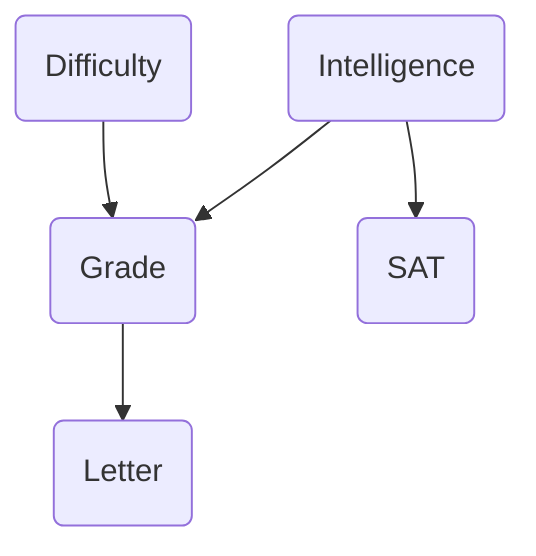
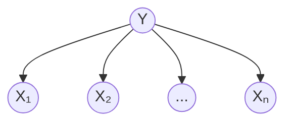

## Introduction of Generative Models [[1]](#references)

When discussing **generative models**, it's essential to understand how machine learning approaches tasks. Consider a scenario where we aim to distinguish between elephants and dogs. There are primarily two modeling approaches: discriminative and generative:

1. **Discriminative Modeling:** This approach involves building a model that directly predicts **classification labels** or identifies the **decision boundary** between elephants and dogs.
2. **Generative Modeling:** This approach entails constructing separate models for elephants and dogs, capturing their **respective characteristics**. A new animal is then compared against each model to determine which it resembles more closely.

In discriminative modeling, the focus is on learning the conditional probability of labels given the input data, denoted as 
$$p(y|{x})$$. Techniques like logistic regression exemplify this by modeling the probability of a label based on input features. Alternatively, methods such as the perceptron algorithm aim to find a decision boundary that maps new observations to specific labels $$\{0,1\}$$, such as $$0$$ for dogs and $$1$$ for elephants.

Conversely, generative modeling focuses on understanding how the data is generated by learning the joint probability distribution $$p(x,y)$$ or the likelihood 
$$p(x|y)$$ along with the prior probability $$p(y)$$. This approach models the distribution of the input data for each class, enabling the generation of new data points and facilitating classification by applying Bayes rule to compute the posterior probability:

$$ 
p(y|x) = \frac{p(x|y)p(y)}{p(x)}
$$

The denominator $$p(x)$$ is the marginal probability that sums the joint probability $$p(x,y)$$ over all possible labels $$y$$:

$$
\begin{aligned}
p(x) &= \sum_{y} p(x,y) \\
     &= \sum_{y} p(x|y)p(y) \\
     &= p(x|y=0)p(y=0) + p(x|y=1)p(y=1)
\end{aligned}
$$

Actually, $$p(x)$$ acts as a **normalization constant** since it does not depend on the label $$y$$. To be more specific, $$p(x)$$ remains unchanged regardless of how $$y$$ varies. Therefore, when calculating 
$$p(y|x)$$, we do not need to compute $$p(x)$$:

$$
\begin{aligned}
\arg\max_y p(y|x) &= \arg\max_y \frac{p(x|y)p(y)}{p(x)}\\
&= \arg\max_y p(x|y)p(y) \\
\end{aligned}
$$

Let's consider a new task of spam classification. $$ x^{(i)} $$ is the feature vector of the $$i$$-th email, and $$ y^{(i)} $$ is the label indicating whether the email is spam ($$1$$) or not spam ($$0$$). The following examples illustrate how discriminative and generative models approach the same problem differently.

### Example 1: Logistic Regression as a Discriminative Model

Since it is a binary classification problem, it makes sense to choose a hypothesis $$h_{\theta}(x)$$ that ranges in $$(0,1)$$ to represent the probability of 
$$p(y=1|x)$$, where 
$$p(y=0|x) = 1 - h_{\theta}(x)$$. We can set the threshold of $$h_{\theta}(x)$$ to be $$0.5$$ to predict if an email is spam. The logistic function fits this case well as it ranges in $$(0,1)$$ for $$z\in(-\infty, +\infty)$$:

$$
h_{\theta}(x) = g(\theta^T x) = \frac{1}{1 + e^{-\theta^T x}}
$$

where 

$$
g(z) = \frac{1}{1 + e^{-z}} 
$$ 

is called the logistic function or sigmoid function. Below is a plot of the sigmoid function:

{: width="300" height="250" }

From the plot, we can see that $$g(z)$$ tends to $$0$$ as $$z\to-\infty$$ and tends to $$1$$ as $$z\to+\infty$$. When $$z=0$$, $$g(z)=0.5$$. The function $$g(z)$$ or $$h_{\theta}(x)$$ is always bounded between $$0$$ and $$1$$. To maintain the convention of letting $$x_0=1$$, we can rewrite the expression of $$z$$ in the hypothesis as $$z = \theta^T x = \theta_0 + \sum_{j=1}^n \theta_j x_j$$, where $$\theta_0$$ is the bias term and $$\theta_j$$ is the weight of the $$j$$-th feature $$x_j$$. Please note that other functions that smoothly and monotonically increase from $$0$$ to $$1$$ can also be considered for $$h_{\theta}(x)$$.

Now we can continue to use maximum likelihood estimation to find the best parameters $$\theta$$ for the logistic regression model. To indicate $$\theta$$ as the parameter vector in the conditional probability distribution 
$$p(y|x)$$, we can rewrite the expression of $$p(y|x)$$ as:

$$
\begin{aligned}
p(y=1|x;\theta) &= h_{\theta}(x) \\
p(y=0|x;\theta) &= 1 - h_{\theta}(x) \\
p(y|x;\theta) &= (h_{\theta}(x))^y (1-h_{\theta}(x))^{1-y}
\end{aligned}
$$

Assuming that $$n$$ training examples are drawn independently from the same distribution, we can write the likelihood function of parameter $$\theta$$ as:

$$
\begin{aligned}
L(\theta) &= p(\vec{y}|X;\theta) \\
&= p(y^{(1)},y^{(2)},...,y^{(n)}|x^{(1)},x^{(2)},...,x^{(n)};\theta) \\
&= \prod_{i=1}^n p(y^{(i)}|x^{(i)};\theta) \\
&= \prod_{i=1}^n (h_{\theta}(x^{(i)}))^{y^{(i)}}(1-h_{\theta}(x^{(i)}))^{1-y^{(i)}} \\
\end{aligned}
$$

Since it is easier to work with the log-likelihood function to maximize, we can take the logarithm of the likelihood function:

$$
\begin{aligned}
\ell(\theta) = \log{L}(\theta) &= \log\prod_{i=1}^n (h_{\theta}(x^{(i)}))^{y^{(i)}}(1-h_{\theta}(x^{(i)}))^{1-y^{(i)}} \\
&= \sum_{i=1}^n y^{(i)}\log h_{\theta}(x^{(i)}) + \sum_{i=1}^n (1-y^{(i)})\log(1-h_{\theta}(x^{(i)})) \\
&= \left[\begin{array}{cccc}
  y^{(1)} & y^{(2)} & \cdots & y^{(n)}  \\
\end{array}\right]log
\begin{bmatrix}
  g(\theta^T x^{(1)})  \\
  g(\theta^T x^{(2)}) \\
  \vdots \\
  g(\theta^T x^{(n)})
\end{bmatrix} + 
\left[\begin{array}{cccc}
  1-y^{(1)} & 1-y^{(2)} & \cdots & 1-y^{(n)}  \\
\end{array}\right]log
\begin{bmatrix}
  (1-g(\theta^T x^{(1)}))  \\
  (1-g(\theta^T x^{(2)})) \\
  \vdots \\
  (1-g(\theta^T x^{(n)}))
\end{bmatrix} \\
&= y^T\log{g(X\theta)} + (1-y)^T\log{(1-g(X\theta))}
\end{aligned}
$$

As we choose the sigmoid function $$g(z)$$ to represent the hypothesis $$h_{\theta}(x)$$, let's first compute the derivative of $$g(z)$$ with respect to $$z$$:

$$
\begin{aligned}
g^\prime(z) &= \frac{d}{dz}\frac{1}{1+e^{-z}} \\
&= \frac{-1}{(1+e^{-z})^2}\frac{d}{dz}(1+e^{-z}) = \frac{-1}{(1+e^{-z})^2}(-e^{-z}) \\
&= \frac{e^{-z}}{(1+e^{-z})^2} = \frac{1}{(1+e^{-z})}(1-\frac{1}{1+e^{-z}}) \\
&= g(z)(1-g(z))
\end{aligned}
$$

Then apply the chain rule to compute the derivative of $$\ell(\theta)$$ with respect to $$\theta$$. To simplify, we will only consider the derivative of $$\ell(\theta)$$ with respect to $$\theta_j$$ for each training example $$x^{(i)}$$ and label $$y^{(i)}$$. As we only use sample $$i$$ to compute the derivative, we can drop the index $$i$$ for convenience:

$$
\begin{aligned}
\frac{\partial}{\partial \theta_j} \ell(\theta) &= \left(y\frac{1}{g(\theta^T{x})} - (1-y)\frac{1}{1-g(\theta^T{x})}\right)\frac{\partial}{\partial \theta_j}g(\theta^T{x}) \\
&= \left(y\frac{1}{g(\theta^T{x})} - (1-y)\frac{1}{1-g(\theta^T{x})}\right)g(\theta^T{x})(1-g(\theta^T{x}))\frac{\partial}{\partial \theta_j}\theta^T{x} \\
&= \left(y\frac{1}{g(\theta^T{x})} - (1-y)\frac{1}{1-g(\theta^T{x})}\right)g(\theta^T{x})(1-g(\theta^T{x}))x_j \\
&= \left(y(1-g(\theta^T{x})) - (1-y)g(\theta^T{x})\right)x_j \\
&= (y-h_{\theta}(x))x_j
\end{aligned}
$$

This leads us to the stochastic gradient ascent rule, where $$(y^{(i)}-h_{\theta}(x^{(i)}))x_j^{(i)}$$ is the gradient of the log-likelihood function with respect to the $$i$$-th training example:

$$
\theta_j := \theta_j + \alpha(y^{(i)}-h_{\theta}(x^{(i)}))x_j^{(i)}
$$

### Example 2: Gaussian Discriminant Analysis as a Generative Model

Let's say the feature vector $$x$$ of an email is using TF-IDF [[2]](#references) that measures the importance of words in the email. TF-IDF (Term Frequency-Inverse Document Frequency) is a numerical statistic that reflects the importance of a word in a document relative to a collection of documents (corpus). It is calculated as:

$$
\text{TF-IDF}(t, d) = \text{TF}(t, d) \times \text{IDF}(t)
$$

where:

$$
\begin{aligned}
\text{TF}(t, d) &= \frac{\text{Number of times term } t \text{ appears in document } d}{\text{Total number of terms in document } d} \\
\text{IDF}(t) &= \log\left(\frac{\text{Total number of documents}}{\text{Number of documents containing term } t}\right)
\end{aligned}
$$

As TF-IDF is continuous we can model 
$$p(x|y)$$ as a multivariate normal distribution. Then the model can be represented as:

$$
\begin{aligned}
y &\sim \text{Bernoulli}(\phi) \\
x|y=0 &\sim \mathcal{N}(\mu_0, \Sigma) \\
x|y=1 &\sim \mathcal{N}(\mu_1, \Sigma)
\end{aligned}
$$

Writing out the distributions, we have:

$$
\begin{aligned}
p(y) &= \phi^y(1-\phi)^{1-y} \\
p(x|y=0) &= \frac{1}{(2\pi)^{n/2}|\Sigma|^{1/2}}exp\left(-\frac{1}{2}(x-\mu_0)^T\Sigma^{-1}(x-\mu_0)\right) \\
p(x|y=1) &= \frac{1}{(2\pi)^{n/2}|\Sigma|^{1/2}}exp\left(-\frac{1}{2}(x-\mu_1)^T\Sigma^{-1}(x-\mu_1)\right) \\
\end{aligned}
$$

Therefore, the log-likelihood of the data is:

$$
\begin{aligned}
\ell(\phi, \mu_0, \mu_1, \Sigma) &= \log\prod_{i=1}^n p(x^{(i)}, y^{(i)};\phi, \mu_0, \mu_1, \Sigma) \\
&= \log\prod_{i=1}^n p(x^{(i)}|y^{(i)};\mu_0, \mu_1, \Sigma)p(y^{(i)};\phi) 
\end{aligned}
$$

By maximizing the log-likelihood, we can derive the parameters of the model. The MLE estimates of the parameters are:

$$
\begin{aligned}
\phi &= \frac{1}{n}\sum_{i=1}^n 1\{y^{(i)}=1\} \\
\mu_0 &= \frac{\sum_{i=1}^n 1\{y^{(i)}=0\}x^{(i)}}{\sum_{i=1}^n 1\{y^{(i)}=0\}} \\
\mu_1 &= \frac{\sum_{i=1}^n 1\{y^{(i)}=1\}x^{(i)}}{\sum_{i=1}^n 1\{y^{(i)}=1\}} \\
\Sigma &= \frac{1}{n}\sum_{i=1}^n (x^{(i)}-\mu_{y^{(i)}})(x^{(i)}-\mu_{y^{(i)}})^T
\end{aligned}
$$

The following figure shows the training set and the contours of two Gaussian distributions. These two Guassian distributions share the same covariance matrix $$\Sigma$$, leading to the same shape and orientation of the contours. But they have different means $$\mu_0$$ and $$\mu_1$$, leading to different positions of the contours. The straight line shown in the figure is the decision boundary at which 
$$p(y=1|x) = 0.5$$. Thus on the left side of the line, the model predicts $$y=0$$ and on the right side, the model predicts $$y=1$$.

**{: width="450" height="300" }

**Figure 1:** Gaussian Discriminant Analysis. Image source: Section 4.1.2 on page 40 from [Stanford CS229 Notes](https://cs229.stanford.edu/main_notes.pdf).
{: .text-center .small}**

### Comparison between Discriminative and Generative Models

Apply the Bayes rule to the generative model GDA (Gaussian Discriminant Analysis), we have:

$$
\begin{aligned}
p(y=1|x) &= \frac{p(x|y=1)p(y=1)}{p(x|y=1)p(y=1) + p(x|y=0)p(y=0)} \\
&= \frac{\exp\left\{ -\frac{1}{2} (x - \mu_1)^T \Sigma^{-1}(x - \mu_1) \right\} \phi}
{\exp\left\{ -\frac{1}{2} (x - \mu_1)^T \Sigma^{-1} (x - \mu_1) \right\} \phi
+ \exp\left\{ -\frac{1}{2} (x - \mu_0)^T \Sigma^{-1} (x - \mu_0) \right\} (1 - \phi)} \\
&= \frac{1}{1+\exp\left\{ -\frac{1}{2} (x - \mu_1)^T \Sigma^{-1} (x - \mu_1) + \frac{1}{2} (x - \mu_0)^T \Sigma^{-1} (x - \mu_0) \right\}  \frac{1 - \phi}{\phi}} \\
&= \frac{1}{1 + \exp\left\{ -\left[ (\Sigma^{-1} (\mu_1 - \mu_0))^T x + \frac{1}{2} (\mu_0 + \mu_1)^T \Sigma^{-1} (\mu_0 - \mu_1)  
- \ln \left( \frac{1 - \phi}{\phi} \right) \right]\right\} }\\
\end{aligned}
$$

$$
\begin{aligned}
\theta &= \Sigma^{-1} (\mu_1 - \mu_0) \\
\theta_0 &= \frac{1}{2} (\mu_0 + \mu_1)^T \Sigma^{-1} (\mu_0 - \mu_1) - \ln \left( \frac{1 - \phi}{\phi} \right)
\end{aligned}
$$

From the derivation above, we found that
$$p(y=1|x;\phi, \mu_0, \mu_1, \Sigma)$$ can actually be viewed as a function of $$x$$ in the following form:

$$
p(y=1|x;\phi, \mu_0, \mu_1, \Sigma) = \frac{1}{1+\exp(-\theta^T x)}
$$

This reveals a profound connection between logistic regression and GDA: the parameters $$\theta$$ in logistic regression can be directly expressed as functions of the GDA parameters $$\phi, \mu_0, \mu_1, \Sigma$$. Remarkably, the resulting form is mathematically identical to the hypothesis function used in logistic regression, which models the conditional probability 
$$p(y|x)$$ discriminatively. This equivalence demonstrates how these seemingly different approaches can converge to similar mathematical formulations despite their distinct underlying philosophies.

The GDA model and the logistic regression model produce distinct decision boundaries when trained on identical datasets, despite their mathematical connections. These fundamental differences between the generative GDA model and the discriminative logistic regression model can be understood through the following key points:

- In the GDA model, when 
  $$p(x|y)$$ follows a multivariate Gaussian distribution with a shared covariance matrix, $$p(y|x)$$ will necessarily take the form of a sigmoid function. However, the converse doesn't hold: defining $$p(y|x)$$ as a sigmoid function doesn't guarantee that $$p(x|y)$$ follows a multivariate Gaussian distribution. This demonstrates that GDA imposes stronger modeling assumptions than logistic regression.

- Because of these stronger assumptions, GDA excels when these assumptions accurately reflect the underlying data distribution. In contrast, logistic regression, with its more flexible and weaker assumptions, demonstrates greater robustness across diverse data distributions, provided there's sufficient training data available.

To be more general, this comparison can be extended to all discriminative and generative models. Generative models learn the joint probability distribution $$p(x,y)$$ and make stronger assumptions about the data, which is beneficial when these assumptions hold true and training data is limited. Discriminative models, on the other hand, directly learn the conditional probability 
$$p(y|x)$$ without modeling the input distribution, making them more robust to misspecification of the data distribution but typically requiring larger datasets to achieve optimal performance.

## From Bayesian Graphical Networks to Deep Generative Models

A key feature of generative models is their ability to learn and represent the underlying data distribution, allowing them to generate new data points. In essence, a generative model defines a probability distribution over the data, denoted as $$p(x)$$. This raises an important question: how can we efficiently model complex data distributions, especially in high-dimensional spaces where numerous random variables are involved? 

For instance, when classifying grayscale images of digits (like in the MNIST dataset) with 28×28 pixels, we have 784 random variables. Even in a binary black and white case where each pixel takes either 0 or 255, we would have $$2^{784}$$ possible configurations - an astronomically large number that makes direct estimation of the joint probability computationally intractable.

{: width="500" height="150" }

**Figure 2:** Example of a grayscale digit from the MNIST dataset.
{: .text-center .small}

### The Challenge of Joint Probability Estimation

How can we effectively model the joint probability distribution over all variables $$\{x_1, x_2, ..., x_n\}$$? To specify this distribution completely, we would need to estimate $$2^{n}-1$$ parameters (where n=784 in our digit example), with the last parameter determined by the constraint that probabilities must sum to 1. This exponential growth in parameters makes direct estimation practically impossible.

The solution lies in factorizing the joint probability distribution into a product of simpler **conditional probability distributions (CPDs)** that require fewer parameters to estimate. Let's explore several approaches to factorization:

### Factorization Approaches for Joint Distributions

#### 1. Independence Assumption

The simplest factorization assumes all variables are statistically independent:

$$
p(x_1, x_2, ..., x_n) = p(x_1)p(x_2) \ldots p(x_n)
$$

This reduces the parameter count from $$2^n-1$$ to just $$n$$, as each $$p(x_i)$$ requires only one parameter for binary variables. However, this assumption is rarely valid for structured data like images, where pixels exhibit strong spatial dependencies. Models built on this assumption fail to capture the coherent shape of digits, as illustrated below:

{: width="350" height="150" }

**Figure 3:** Generated digits when assuming pixel independence - note the lack of structure.
{: .text-center .small}

#### 2. Chain Rule Factorization

The chain rule of probability offers a mathematically exact factorization:

$$
p(x_1, x_2, ..., x_n) = p(x_1)p(x_2|x_1)p(x_3|x_1,x_2)...p(x_n|x_1,x_2,...,x_{n-1})
$$

While this is mathematically correct, it doesn't reduce computational complexity. The parameter count remains at $$2^0+2^1+2^2+...+2^{n-1}=2^{n}-1$$, which is still exponential in the number of variables.

#### 3. Markov Chain Assumption

If we assume each variable depends only on its immediate predecessor (first-order Markov property: 
$$X_{i+1} \perp X_1,...,X_{i-1} | X_i$$), we can simplify the factorization to:

$$
\begin{align*}
p(x_1, \ldots, x_n) &= p(x_1)p(x_2|x_1)p(x_3|\not{x_1},x_2) \ldots p(x_n|\not{x_1},\not{\ldots},x_{n-1})\\
&= p(x_1)p(x_2|x_1)p(x_3|x_2)\ldots p(x_n|x_{n-1}) 
\end{align*}
$$

Here we have 1 parameter for $$p(x_1)$$, 
2 parameters for all other $$p(x_i|x_{i-1})$$, reducing the parameter count to $$1+2(n-1)=2n-1$$, scaling linearly with the number of variables. This dramatic reduction demonstrates how conditional independence assumptions can make high-dimensional probability modeling tractable.

### Bayesian Networks: Graphical Representation of Probabilistic Dependencies

The Markov chain assumption represents a special case of a more general framework called **Bayesian networks** (also known as **belief networks** or **directed graphical models**). Bayesian networks provide a powerful visual and mathematical framework for representing complex probabilistic relationships among multiple random variables.

A Bayesian network is a directed acyclic graph (DAG) that encodes the joint probability distribution of a collection of random variables. In this framework, we denote the graph as $$G=(V,E)$$, where:
- $$V$$ is the set of nodes, with each node corresponding to a random variable, denoted as $$x_i$$ for convenience.
- $$E$$ represents the set of directed edges, which indicate conditional dependencies between the random variables.

The fundamental principle of Bayesian networks is that the joint probability distribution over all variables $$\{x_1, x_2, ..., x_n\}$$ can be factorized into a product of conditional probability distributions (CPDs) based on the graph structure:

$$
p(x_1, x_2, ..., x_n) = \prod_{i=1}^n p(x_i | \text{pa}(x_i))
$$

where $$\text{pa}(x_i)$$ is the set of parents of $$x_i$$ in the graph $$G$$. This factorization leverages conditional independence assumptions encoded by the graph structure, potentially reducing the number of parameters needed to specify the distribution from exponential to linear or polynomial in the number of variables.

#### An Illustrative Example

Consider the following Bayesian network that models factors affecting a student's academic outcomes:

In this example:
- Intelligence (I) influences both Grade (G) and SAT score (S)
- Course Difficulty (D) influences Grade (G)
- Grade (G) influences the recommendation Letter (L)

Applying the general chain rule of probability, we could factorize the joint probability distribution as:

$$
p(d,i,g,s,l) = p(d)p(i|d)p(g|i,d)p(s|i,d,g)p(l|i,d,g,s)
$$

However, the Bayesian network structure encodes specific conditional independence assumptions that allow us to simplify this factorization to:

$$
p(d,i,g,s,l) = p(d)p(i)p(g|i,d)p(s|i)p(l|g)
$$

These simplifications reflect the following conditional independence assumptions:
$$I \perp D$$ , $$S \perp \{D,G\} | I$$ , $$L \perp \{I,D,S\} | G$$. This example demonstrates how Bayesian networks can dramatically reduce the complexity of modeling joint distributions by encoding domain knowledge through graphical structure.

#### Generative vs. Discriminative Bayesian Networks

Returning to our grayscale digit classification example, let's examine how Bayesian networks can represent both generative and discriminative approaches.

In a **generative model** with the naive Bayes assumption, we structure our network with the label variable $$y$$ as the parent of all feature variables:

This structure encodes the assumption that all features are conditionally independent given the class label, resulting in the factorization:

$$
p(y,x_1,x_2,...,x_n) = p(y) \prod_{i=1}^n p(x_i|y)
$$

In the generative approach, we explicitly model both $$p(y)$$ (class prior) and 
$$p(\mathbf{x}|y)$$ (conditional density for continuous features or conditional probability for discrete features) to represent $$p(\mathbf{x},y)$$.

Alternatively, the **discriminative approach** directly models 
$$p(y|\mathbf{x})$$ without explicitly representing how the features themselves are generated. Using the chain rule, $$p(\mathbf{x},y) = p(y)p(\mathbf{x}|y) = p(\mathbf{x})p(y|\mathbf{x})$$, we can see that for classification purposes, we only need to learn $$p(y|\mathbf{x})$$ without modeling $$p(\mathbf{x})$$.

Maintaining all dependencies in a generative model by applying the chain rule would give us:

$$
p(y,x_1,x_2,...,x_n) = p(y)p(x_1|y)p(x_2|y,x_1)p(x_3|y,x_1,x_2)...p(x_n|y,x_1,x_2,...,x_{n-1})
$$

While for the discriminative approach:

$$
p(y,x_1,x_2,...,x_n) = p(x_1)p(x_2|x_1)p(x_3|x_1,x_2)...p(x_n|x_1,x_2,...,x_{n-1})p(y|x_1,x_2,...,x_n)
$$

{: width="500" height="250"}

**Figure 4:** Visual representation of generative models (left) vs discriminative models (right). In generative models, we model how Y generates X values, while in discriminative models, we model how X values determine Y. Image source: [Stanford CS236 Lecture 2](https://deepgenerativemodels.github.io/assets/slides/cs236_lecture2.pdf).
{: .text-center .small}

From the figure above, we can observe that generative models are inherently more complex because they must model the joint distribution $$p(\mathbf{x},y)$$. This complexity stems from the need to capture the complete data generation process, which requires estimating a larger number of parameters. However, this doesn't necessarily mean that learning discriminative models is significantly easier. In high-dimensional feature spaces,  discriminative models also encounter significant challenges. For example, when features $$\mathbf{x}$$ are binary, discriminative models still need to estimate $$2^n$$ parameters for 
$$p(y|x_1,x_2,...,x_n)$$. Both approaches face computational and statistical challenges that grow with the dimensionality of the data, though they differ in how they allocate model complexity.

### More Efficient Approaches for Representing CPDs

Based on our previous discussion, we've seen that representing conditional probability distributions (CPDs) using explicit tables becomes intractable as dimensionality increases. For discriminative models, we would need to store $$2^n$$ parameters for 
$$p(y|x_1,x_2,...,x_n)$$, while generative models would require even more—$$2^{n+1}-1$$ parameters, just for binary features. To address this challenge, we can employ several more efficient representation strategies:

1. Exploit conditional independence assumptions to reduce parameter space
2. Use parametric models with linear dependencies to represent probabilistic relationships
3. Employ neural networks to capture complex nonlinear relationships

#### 1. Exploiting Conditional Independence

The most straightforward approach is to simplify the Bayesian network structure by introducing conditional independence assumptions. In the generative naive Bayes model, for instance, we assume all features are conditionally independent given the class label:

$$
p(\mathbf{x},y) = p(y) \prod_{i=1}^n p(x_i|y)
$$

This dramatically reduces the parameter count from exponential to linear ($$n+1$$) in the number of features. However, this approach has significant limitations—the strong conditional independence assumptions may eliminate crucial dependencies between features, leading to suboptimal model performance. As we saw in our earlier example with digit generation in [Figure 3](#1-independence-assumption), assuming independence between pixels produces incoherent images that lack structural integrity. To balance computational efficiency with model expressiveness, we can employ functional representations that automatically capture probabilistic relationships between variables without requiring explicit human specification of the dependency structure.

#### 2. Logistic Regression for Linear Dependency

Recall the [example on logistic regression](#example-1-logistic-regression-as-a-discriminative-model), we can model 
$$p(y|\mathbf{x})$$ as a parametric function that maps features $$\mathbf{x}$$ to conditional probability values:

$$
\begin{aligned}
z(\mathbf{x};\mathbf{\theta}) &= \theta^T\mathbf{x} = \theta_0 + \sum_{i=1}^n \theta_i x_i \\
p(y=1|\mathbf{x};\mathbf{\theta}) &= \sigma(z(\mathbf{x};\mathbf{\theta})) = \frac{1}{1+\exp(-z(\mathbf{x};\mathbf{\theta}))}
\end{aligned}
$$

Here, we use a linear function $$z(\mathbf{x};\mathbf{\theta})$$ to model the relationship between features $$\mathbf{x}$$ and label $$y$$, then apply the sigmoid function $$\sigma(z)$$ to map this linear output to probability values. This approach also requires only $$n+1$$ parameters, making it computationally efficient.

Unlike naive Bayes, logistic regression doesn't assume conditional independence among features, allowing it to capture more complex feature interactions through the linear combination of inputs. This makes it more flexible while maintaining computational efficiency.

#### 3. Neural Networks for Complex Dependencies

For more complex relationships that cannot be adequately captured by linear models, neural networks provide a powerful solution by introducing nonlinear transformations of the input features. Each transformation can be represented as $$h(w,b,\mathbf{x})=f(w^T\mathbf{x}+b)$$, where $$f$$ is a nonlinear activation function. By stacking multiple such transformations in sequence, we create a neural network as follows:

$$
\begin{aligned}
h^{(1)} &= f^{(1)}(w^{(1)T}\mathbf{x} + b^{(1)}) \\
h^{(2)} &= f^{(2)}(w^{(2)T}h^{(1)} + b^{(2)}) \\
&\vdots \\
p_{neural}(y=1|\mathbf{x};\theta,W,\mathbf{b}) &= \sigma(\theta^{T}[h^{(L-1)},1])
\end{aligned}
$$

Where $$f^{(l)}$$ represents non-linear activation functions like ReLU, tanh, or sigmoid at layer $$l$$. With sufficient hidden units, neural networks can approximate arbitrarily complex functions—a property known as universal approximation. While they introduce more parameters than logistic regression, they remain far more parameter-efficient than explicit CPD tables for high-dimensional data.

#### Comparing Approaches: From Bayesian Networks to Neural Networks

Let's compare how different approaches model the joint probability distribution:

**Full Chain Rule** provides a mathematically exact full expression but computationally intractable factorization.
  
$$p(x_1,x_2,...,x_n) = p(x_1)p(x_2|x_1)p(x_3|x_1,x_2)...p(x_n|x_1,x_2,...,x_{n-1})$$

**Bayesian Networks** introduce conditional independence assumptions to reduce complexity. While more efficient, these hand-crafted independence assumptions may oversimplify complex relationships and require domain expertise to design effectively.

$$p(x_1,x_2,...,x_n) \approx p(x_1)p(x_2|x_1)p(x_3|\not{x_1},x_2)...p(x_n|\not{x_1},...,\not{x_{n-2}},x_{n-1})$$

**Neural Network Models** revolutionize probabilistic modeling by automatically learning complex dependencies between variables without requiring explicit independence assumptions. They parameterize conditional distributions using flexible neural architectures that assume specific functional forms for the conditionals. A key advantage is that sufficiently deep neural networks can approximate any function with arbitrary precision—a property known as universal function approximation.
   
$$p(x_1,x_2,...,x_n) \approx p(x_1)p(x_2|x_1)p_{neural}(x_3|x_1,x_2)...p_{neural}(x_n|x_1,...,x_{n-1})$$
   
   Neural networks offer several critical advantages for modern applications:
   - **Automatic feature learning**: They discover relevant dependencies without requiring explicit specification
   - **Scalability**: They handle massive datasets and high-dimensional spaces efficiently
   - **Flexibility**: They capture complex non-linear relationships that traditional models cannot represent
   - **Transfer learning**: Pre-trained neural models can adapt to new domains with minimal additional training
   - **End-to-end optimization**: They optimize all parameters simultaneously rather than in separate stages

In real-world applications like image generation, language modeling, and drug discovery, neural approaches have dramatically outperformed traditional probabilistic graphical models. For instance, modern text-to-image models like DALL-E and Stable Diffusion can generate photorealistic images from textual descriptions—a task that would be impossible with traditional Bayesian networks due to the complexity of the underlying distributions and the high-dimensional nature of the data.

## Modern Deep Generative Models  TODO

Modern deep generative models extend these ideas using neural networks to learn complex conditional probability distributions. These include:

1. **Autoregressive Models** - Model the joint distribution as a product of conditionals, often using recurrent or masked architectures
2. **Generative Adversarial Networks (GANs)** - Use an adversarial process to generate highly realistic samples
3. **Diffusion Models** - Build a Markov chain that gradually adds noise to the data until it becomes a simple distribution
4. **Normalizing Flows** - Transform simple distributions into complex ones through invertible transformations
5. **Variational Autoencoders (VAEs)** - Learn a latent space representation that captures the data distribution

These approaches maintain the spirit of Bayesian networks but leverage the expressive power of neural networks to model complex dependencies in high-dimensional data. 

<!-- 
#### Learning and Inference in Bayesian Networks -need to be verified

In practice, Bayesian networks require two key operations:
1. **Learning** - Estimating the structure of the network and/or the parameters of the conditional probability distributions
2. **Inference** - Computing probabilities of interest given observed evidence

Parameter learning can be done through maximum likelihood estimation or Bayesian approaches, while structure learning often involves scoring different network structures based on how well they fit the data while maintaining simplicity.

For inference, exact methods like variable elimination and belief propagation work well for small networks, while approximate methods like Markov Chain Monte Carlo (MCMC) sampling are used for more complex networks.

#### Connection to Modern Deep Generative Models

The conditional independence assumptions encoded in Bayesian networks provide the theoretical foundation for many modern deep generative models. Neural networks now allow us to represent complex conditional probability distributions that would be intractable with traditional parametric approaches.

For example, autoregressive models like PixelCNN and WaveNet implement the chain rule factorization using neural networks to model each conditional distribution $$p(x_i|x_1,...,x_{i-1})$$. Similarly, variational autoencoders (VAEs) can be interpreted as Bayesian networks with continuous latent variables and neural network-parameterized conditional distributions.

## Modern Deep Generative Models  TODO

Modern deep generative models extend these ideas using neural networks to learn complex conditional probability distributions. These include:

1. **Autoregressive Models** - Model the joint distribution as a product of conditionals, often using recurrent or masked architectures
2. **Generative Adversarial Networks (GANs)** - Use an adversarial process to generate highly realistic samples
3. **Diffusion Models** - Build a Markov chain that gradually adds noise to the data until it becomes a simple distribution
4. **Normalizing Flows** - Transform simple distributions into complex ones through invertible transformations
5. **Variational Autoencoders (VAEs)** - Learn a latent space representation that captures the data distribution

These approaches maintain the spirit of Bayesian networks but leverage the expressive power of neural networks to model complex dependencies in high-dimensional data. -->

## References

[1] Andrew, Ng. "[CS229: Machine Learning Course Notes](https://cs229.stanford.edu/main_notes.pdf)". Stanford University, 2018. \\
[2] Salton, Gerard & Michael J., McGill. "[Introduction to Modern Information Retrieval](https://archive.org/details/introductiontomo00salt)". McGraw-Hill, 1983. 
[3] Stefano Ermon, et al. "[CS236 Deep Generative Models Module](https://deepgenerativemodels.github.io/)". Stanford University, Fall 2023.

